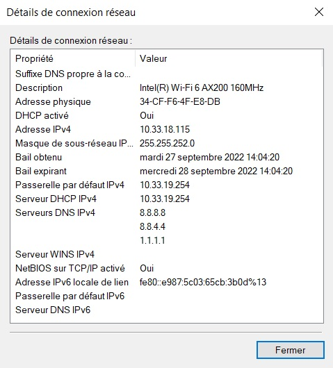
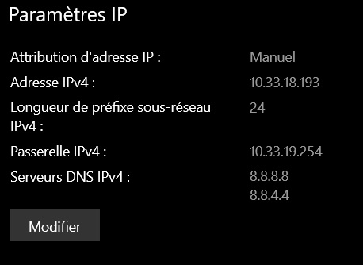
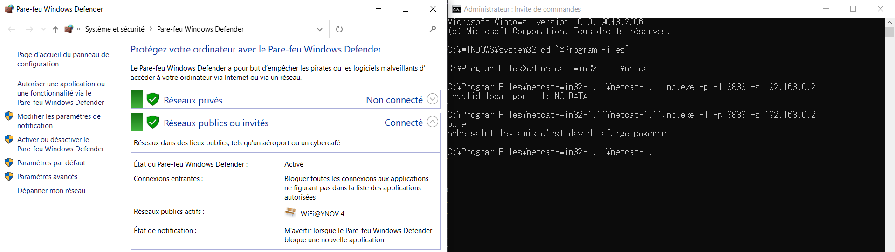
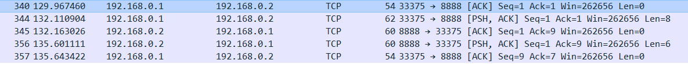
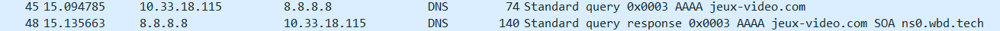

# TP1 - Mise en jambes

## Sommaire
- [TP1 - Mise en jambes](#tp1---mise-en-jambes)
  - [Sommaire](#sommaire)
- [I. Exploration locale en solo](#i-exploration-locale-en-solo)
  - [1. Affichage d'informations sur la pile TCP/IP locale](#1-affichage-dinformations-sur-la-pile-tcpip-locale)
    - [En ligne de commande](#en-ligne-de-commande)
    - [En graphique (GUI : Graphical User Interface)](#en-graphique-gui--graphical-user-interface)
  - [2. Modifications des informations](#2-modifications-des-informations)
    - [A. Modification d'adresse IP (part 1)](#a-modification-dadresse-ip-part-1)
- [II. Exploration locale en duo](#ii-exploration-locale-en-duo)
  - [3. Modification d'adresse IP](#3-modification-dadresse-ip)
  - [4. Utilisation d'un des deux comme gateway](#4-utilisation-dun-des-deux-comme-gateway)
  - [5. Petit chat privé](#5-petit-chat-privé)
  - [6. Firewall](#6-firewall)
- [III. Manipulations d'autres outils/protocoles côté client](#iii-manipulations-dautres-outilsprotocoles-côté-client)
  - [1. DHCP](#1-dhcp)
  - [2. DNS](#2-dns)
- [IV. Wireshark](#iv-wireshark)

# I. Exploration locale en solo

## 1. Affichage d'informations sur la pile TCP/IP locale

### En ligne de commande

**🌞 Affichez les infos des cartes réseau de votre PC**

```
C:\WINDOWS\system32> ipconfig

Configuration IP de Windows


Carte réseau sans fil Connexion au réseau local* 1 :

   Statut du média. . . . . . . . . . . . : Média déconnecté
   Suffixe DNS propre à la connexion. . . :


Carte réseau sans fil Wi-Fi :

   Suffixe DNS propre à la connexion. . . :
   Adresse IPv6 de liaison locale. . . . .: fe80::e987:5c03:65cb:3b0d%13
   Adresse IPv4. . . . . . . . . . . . . .: 10.33.18.115
   Masque de sous-réseau. . . . . . . . . : 255.255.252.0
   Passerelle par défaut. . . . . . . . . : 10.33.19.254
```
**🌞 Affichez votre gateway**
```
C:\WINDOWS\system32>ipconfig /all

Carte réseau sans fil Wi-Fi :
[...]
   Passerelle par défaut. . . . . . . . . : 10.33.19.254
[...]
```

### En graphique (GUI : Graphical User Interface)

**🌞 Trouvez comment afficher les informations sur une carte IP (change selon l'OS)**



**🌞 à quoi sert la gateway dans le réseau d'YNOV ?**
La gateway sert à communiquer avec internet.


## 2. Modifications des informations

### A. Modification d'adresse IP (part 1)

**🌞 Utilisez l'interface graphique de votre OS pour changer d'adresse IP :**


**🌞 Expliquez pourquoi c'est possible de perdre son accès internet en faisant cette opération.**

Il est possible de perdre internet si nous nous sommes attribués une IP déjà utilisée sur le réseau actuel.


# II. Exploration locale en duo

## 3. Modification d'adresse IP

**🌞Si vos PCs ont un port RJ45 alors y'a une carte réseau Ethernet associée :**

```
C:\WINDOWS\system32>ipconfig /all

Carte Ethernet Ethernet :

   Adresse IPv4. . . . . . . . . . . . . .: 192.168.0.2(préféré)
   Masque de sous-réseau. . . . . . . . . : 255.255.255.252
   Passerelle par défaut. . . . . . . . . :
```

```
C:\WINDOWS\system32>ping -c 2 192.168.0.2
PING 192.168.0.2 (192.168.0.2) 56(84) bytes of data.
64 bytes from 192.168.0.2: icmp_seq=1 ttl=128 time=2.13 ms
64 bytes from 192.168.0.2: icmp_seq=2 ttl=128 time=2.30 ms

--- 192.168.0.2 ping statistics ---
2 packets transmitted, 2 received, 0% packet loss, time 1001ms
rtt min/avg/max/mdev = 2.128/2.213/2.299/0.085 ms
```

```
C:\WINDOWS\system32>arp -a
Interface : 192.168.0.1 --- 0xa
  Adresse Internet      Adresse physique      Type
  192.168.0.2           84-a9-3e-10-c3-09     dynamiqu
  192.168.0.3           ff-ff-ff-ff-ff-ff     statique
  224.0.0.22            01-00-5e-00-00-16     statique
  224.0.0.251           01-00-5e-00-00-fb     statique
  224.0.0.252           01-00-5e-00-00-fc     statique
  239.255.255.250       01-00-5e-7f-ff-fa     statique
```

## 4. Utilisation d'un des deux comme gateway


**🌞 utiliser un `traceroute` ou `tracert` pour bien voir que les requêtes passent par la passerelle choisie (l'autre le PC)**

```
C:\WINDOWS\system32>tracert 8.8.8.8

Détermination de l’itinéraire vers dns.google [8.8.8.8]
avec un maximum de 30 sauts :

  1     1 ms     *        1 ms  LAPTOP-O33P794M [192.168.0.2]
  2     *        *        *     Délai d’attente de la demande dépassé.
  3     4 ms     4 ms     4 ms  10.33.19.254
  4     7 ms     5 ms     4 ms  137.149.196.77.rev.sfr.net [77.196.149.137]
  5    10 ms     9 ms    10 ms  108.97.30.212.rev.sfr.net [212.30.97.108]
  6    23 ms    21 ms    23 ms  222.172.136.77.rev.sfr.net [77.136.172.222]
  7    25 ms    24 ms    23 ms  221.172.136.77.rev.sfr.net [77.136.172.221]
  8    28 ms    25 ms    24 ms  186.144.6.194.rev.sfr.net [194.6.144.186]
  9    25 ms    25 ms    23 ms  186.144.6.194.rev.sfr.net [194.6.144.186]
 10    22 ms    21 ms    21 ms  72.14.194.30
 11    25 ms    23 ms    23 ms  172.253.69.49
 12    24 ms    23 ms    23 ms  108.170.238.107
 13    26 ms    22 ms    23 ms  dns.google [8.8.8.8]

Itinéraire déterminé.
```

## 5. Petit chat privé
**🌞 Sur le PC serveur**

```
C:\Program Files\netcat-win32-1.11\netcat-1.11>nc64.exe -l -p 8888
bonjour
salut mec
```

**🌞Sur le PC client**

```
C:\Program Files\netcat-1.11> .\nc.exe 192.168.0.2 8888
bonjour
salut mec
```
**🌞 Pour aller un peu plus loin**
```
C:\WINDOWS\system32>netstat -a -b -n | findstr 8888
  TCP    192.168.0.2:8888       192.168.0.1:5180       ESTABLISHED
```

## 6. Firewall

**🌞 Activez votre firewall**
  
  


# III. Manipulations d'autres outils/protocoles côté client

## 1. DHCP

**🌞Exploration du DHCP, depuis votre PC**
```
C:\WINDOWS\system32> ipconfig /all
[...]
   Bail obtenu. . . . . . . . . . . . . . : mercredi 28 septembre 2022 13:57:26
   Bail expirant. . . . . . . . . . . . . : jeudi 29 septembre 2022 13:57:26
   Passerelle par défaut. . . . . . . . . : 10.33.19.254
   Serveur DHCP . . . . . . . . . . . . . : 10.33.19.254

[...]
```

## 2. DNS

**🌞 Trouver l'adresse IP du serveur DNS que connaît votre ordinateur**
```
C:\WINDOWS\system32> ipconfig /all
[...]
   Serveurs DNS. . .  . . . . . . . . . . : 8.8.8.8
                                       8.8.4.4
                                       1.1.1.1
[...]
```
**🌞 Utiliser, en ligne de commande l'outil `nslookup` pour faire des requêtes DNS à la main**
```
C:\WINDOWS\system32> nslookup
Serveur par dÚfaut :   dns.google
Address:  8.8.8.8

> google.com
Serveur :   dns.google
Address:  8.8.8.8

Réponse ne faisant pas autorité :
Nom :    google.com
Addresses:  2a00:1450:4007:808::200e
          216.58.215.46

> ynov.com
Serveur :   dns.google
Address:  8.8.8.8

Réponse ne faisant pas autorité :
Nom :    ynov.com
Addresses:  2606:4700:20::681a:be9
          2606:4700:20::ac43:4ae2
          2606:4700:20::681a:ae9
          104.26.10.233
          172.67.74.226
          104.26.11.233
```

Google possède une adresse IPv6 et une IPv4
Ynov possède une adresse IPv6 et 3 IPv4

**🌞 Déterminer l'adresse IP du serveur à qui vous venez d'effectuer ces requêtes**
```
C:\WINDOWS\system32> nslookup -debug
[...]
Serveur par dÚfaut :   dns.google
Address:  8.8.8.8
```
**🌞 Faites un reverse lookup**
```
C:\WINDOWS\system32> nslookup
[...]
> 78.74.21.21
Serveur :   dns.google
Address:  8.8.8.8

Nom :    host-78-74-21-21.homerun.telia.com
Address:  78.74.21.21
> 92.146.54.88
Serveur :   dns.google
Address:  8.8.8.8

*** dns.google ne parvient pas à trouver 92.146.54.88 : Non-existent domain
```

L'adresse IP 78.74.21.21 appartient à Telia Company AB alors que l'adresse IP 92.146.54.88 n'a pas de nom de domaine.

# IV. Wireshark

**🌞 utilisez le pour observer les trames qui circulent entre vos deux carte Ethernet. Mettez en évidence :**

  - un `ping` entre vous et la passerelle

  - un `netcat` entre vous et votre mate, branché en RJ45

  - une requête DNS. Identifiez dans la capture le serveur DNS à qui vous posez la question.



